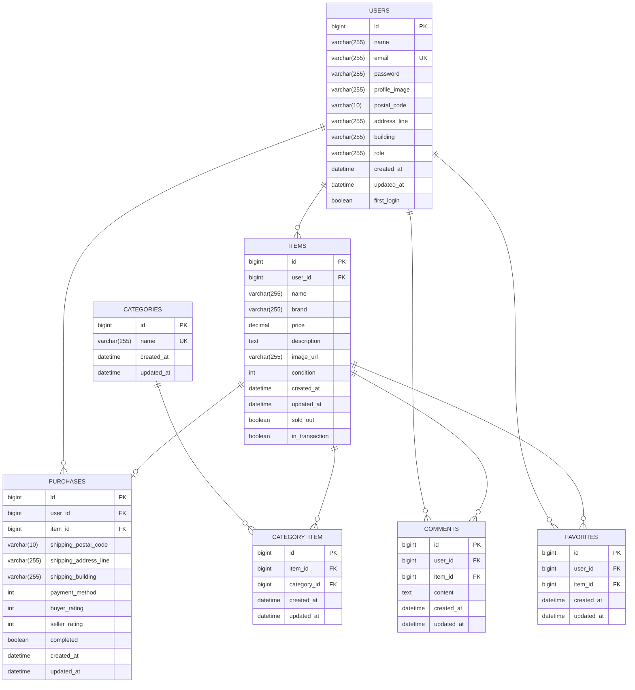

# coachtechフリマ

## 環境構築
**Dockerビルド**
1. `git clone git@github.com:hiroyuki92/flea-market-app-pro-test.git`
2. `cd flea-market-app-pro-test`     クローンしたディレクトリに移動する
3. DockerDesktopアプリを立ち上げる
4. `docker-compose up -d --build`

**Laravel環境構築**
1. `docker-compose exec php bash`
2. `composer install`
3. 「.env.example」ファイルをコピーして 「.env」ファイルに命名を変更。
```bash
cp .env.example .env
```
4. 「.env.testing.example」ファイルをコピーして 「.env.testing」ファイルに命名を変更。
```bash
cp .env.testing.example .env.testing
```
5. .envに以下の環境変数を追加
``` text
DB_CONNECTION=mysql
DB_HOST=mysql
DB_PORT=3306
DB_DATABASE=laravel_db
DB_USERNAME=laravel_user
DB_PASSWORD=laravel_pass
```
6. .env.testingに以下の環境変数を追加
``` text
DB_CONNECTION=mysql
DB_HOST=mysql
DB_PORT=3306
DB_DATABASE=demo_test
DB_USERNAME=laravel_user
DB_PASSWORD=laravel_pass
```
7. 各環境のアプリケーションキーを生成
``` bash
php artisan key:generate        # .env用
php artisan key:generate --env=testing  # .env.testing用
```

8. マイグレーションとシーディングの実行
``` bash
php artisan migrate --seed
```  
　実行すると以下の初期データが作成されます   
  - 一般ユーザー（３人）  
	ダミーユーザーが3人生成されます。  
	⚫︎一般ユーザー（一人目）CO01〜CO05を出品    
	メールアドレス: user1@example.com    
	パスワード: password

	⚫︎一般ユーザー（二人目）CO06〜CO10を出品    
	メールアドレス: user2@example.com    
	パスワード: password 

	⚫︎一般ユーザー（三人目）  
	メールアドレス: user3@example.com    
	パスワード: password 

9. ストレージリンクの作成
``` bash
php artisan storage:link
```
10. Stripe決済機能の設定 
 
 	⚫︎Stripeアカウントの準備
  	 - [Stripe Dashboard](https://dashboard.stripe.com/register)でアカウントを作成
  	 - テストモードになっていることを確認（右上のスイッチで切り替え可能）
  	 - Developers > API keysセクションからAPIキーを取得:
  	   - シークレットキー（sk_test_...）
   	   - 公開可能キー（pk_test_...）

 	⚫︎テスト環境用の環境変数設定
   	- `.env`と`.env.testing`ファイルに以下を追加：
 	  ```env
   		STRIPE_SECRET=sk_test_あなたのシークレットキー
   		STRIPE_KEY=pk_test_あなたの公開可能キー
   		```

	#### Stripe決済機能の設定の注意事項
	- シークレットキーは絶対に公開リポジトリにコミットしないでください

11. メール認証機能の設定  
    #### 機能概要
	このアプリケーションには、ユーザー登録時にメールアドレスを確認するためのメール認証機能が実装されています。この機能により、不正なアカウント作成を防ぎ、アプリケーションのセキュリティを向上させます。

    #### 開発環境でのメール確認方法
	このプロジェクトでは、開発環境でのメール確認にMailHogを使用します。以下の手順でセットアップを行ってください。

	1. MailHogをインストールします。
   		- **macOSの場合**:
     		```bash
     		brew install mailhog
     		```
  	 	- **Linuxの場合**:
     		公式リリースページからバイナリをダウンロードしてください。
     		[https://github.com/mailhog/MailHog/releases](https://github.com/mailhog/MailHog/releases)
   		- **Windowsの場合**:
     		公式ページからバイナリをダウンロードして実行します。

	2. MailHogを起動します。
   		```bash
   		mailhog

	- **デフォルトポート**: `1025`
	- **Web UI**: [http://localhost:8025](http://localhost:8025)  
	送信されたメールはMailHogのWeb UI (http://localhost:8025) で確認できます。

   
12. テストの実行
``` bash
php artisan test
```

## 使用技術(実行環境)
- Laravel8.83.27   
- MySQL8.0.26（Dockerコンテナ）  
- nginx 1.21.1（Dockerコンテナ）   
- Stripe決済システム
- MailHog（開発環境でのメール送信テスト用）

## ER図



## URL
- 開発環境：http://localhost/
- phpMyAdmin:：http://localhost:8080/
